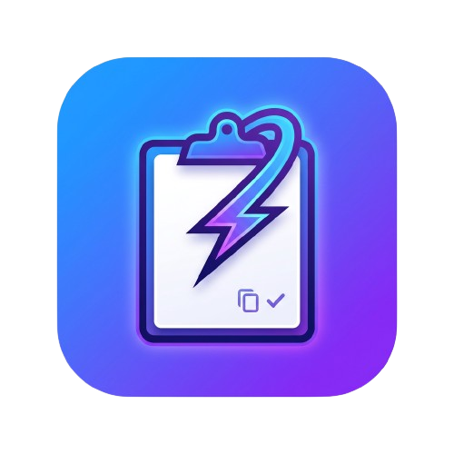

# CopyClickk

Clipboard manager for KDE Plasma with tray integration, image previews, persistent history, and configurable shortcuts.

<p align="center">
	
</p>

<p align="center">
	<strong>Fast clipboard history for KDE workflows</strong>
</p>

<p align="center">
	
	
	
	
	
</p>

## Why CopyClickk

CopyClickk is a KDE-focused clipboard manager designed to be practical, fast, and easy to run in daily workflows.

## Features

- Tray app with menu actions in English: `Show History`, `Clear Clipboard`, `Settings`, `Quit`
- Clipboard capture for text, HTML, URLs, and images
- Image support: PNG, JPG/JPEG, WEBP, BMP, ICO
- Thumbnail preview in history list
- Persistent history in SQLite (`~/.local/share/copyclickk/history.db`)
- Configurable history limit (default `30`) with auto-eviction of oldest entries
- Retention policy presets: `Always`, `1 week`, `1 month`, `3 months`, `6 months`
- Optional skip of consecutive duplicate clipboard entries
- Configurable open-history shortcut with safe fallback to `Ctrl+Alt+V`
- Optional plain-text paste mode for text/HTML/URI entries
- Image handling controls: save images on/off, optional JPEG compression, compression quality
- Start-with-system toggle (autostart file in `~/.config/autostart/copyclickk.desktop`)
- Clear-history confirmation toggle
- Theme selection: `System`, `Light`, `Dark`
- `Reset to Defaults` action in Settings dialog
- Settings persisted in `~/.config/copyclickk/settings.ini`

## Screens and UX

- Tray icon with quick menu actions
- Tray click toggles history visibility (open/close)
- Open-history shortcut toggles history visibility (open/close)
- Image entries shown with thumbnail preview
- HTML clipboard previews are rendered as plain text in the list
- Long text entries are truncated for cleaner list visualization
- Taller history rows improve readability
- Settings dialog is grouped by sections: `History`, `Clipboard`, `Images`, `System`, `Appearance`, `Shortcuts`

## Settings Overview

- `History`:
  - history limit
  - retention period presets
  - skip consecutive duplicates
- `Clipboard`:
  - paste as plain text
  - confirm before clear clipboard
- `Images`:
  - preview size
  - save image entries
  - compress images
  - JPEG compression quality
- `System`:
  - start with system
- `Appearance`:
  - theme (`System`, `Light`, `Dark`)
- `Shortcuts`:
  - open history shortcut
- `Reset to Defaults`:
  - resets form values to default settings
  - changes are saved only after pressing `OK`

## Quick Install (User Scope)

The project includes scripts for easy install/uninstall under your user account (`~/.local`).

Supported desktop environment target: KDE Plasma.
Supported distro families: Fedora, Arch, Debian/Ubuntu, openSUSE (best effort).

1. Make scripts executable:

```bash
chmod +x scripts/install.sh scripts/uninstall.sh
```

2. Install app (dependencies included in the same script):

```bash
./scripts/install.sh
```

Optional: skip dependency installation prompt:

```bash
./scripts/install.sh --skip-deps
```

3. Run:

```bash
~/.local/bin/copyclickk_tray
```

## One-Command Flow

```bash
chmod +x scripts/install.sh scripts/uninstall.sh
./scripts/install.sh
```

## Uninstall

```bash
./scripts/uninstall.sh
```

The uninstall script:

- removes installed app files (`binary`, `desktop entry`, copied assets)
- asks whether to delete user data and settings
- optionally deletes `~/.local/share/copyclickk`
- optionally deletes `~/.config/copyclickk`

## Compatibility

- Desktop target: KDE Plasma
- Distros: Fedora, Arch, Debian/Ubuntu, openSUSE (best effort)
- Wayland and X11: supported with behavior depending on compositor/session restrictions

## Manual Build (Dev)

Fedora dependencies:

```bash
sudo dnf install -y cmake gcc-c++ ninja-build sqlite-devel qt6-qtbase-devel kf6-kglobalaccel-devel
```

Arch Linux dependencies:

```bash
sudo pacman -S --needed cmake gcc ninja sqlite qt6-base kglobalaccel
```

Debian/Ubuntu dependencies (KDE6 packages depend on release):

```bash
sudo apt update
sudo apt install -y cmake g++ ninja-build libsqlite3-dev qt6-base-dev
```

openSUSE dependencies:

```bash
sudo zypper install -y cmake gcc-c++ ninja sqlite3-devel qt6-base-devel
```

Build and test:

```bash
cmake -S . -B build -G Ninja -DCOPYCLICKK_BUILD_QT_TRAY_APP=ON
cmake --build build
ctest --test-dir build --output-on-failure
```

Run local binary:

```bash
./build/src/uiqt/copyclickk_tray
```

## Contributing

Contributions are welcome.

1. Read `CONTRIBUTING.md`
2. Create a branch
3. Add tests for behavior changes
4. Open a pull request with clear notes

## Project Structure

- `src/core`: domain models
- `src/storage`: repository implementations (memory + sqlite)
- `src/privacy`: privacy filtering
- `src/ipc`: application service orchestration
- `src/ui`: UI view models
- `src/uiqt`: Qt tray application
- `assets/icons/app`: app icon files (you can customize)
- `assets/icons/tray/clipboard.svg`: tray icon
- `scripts/install.sh`: user-scope installer
- `scripts/uninstall.sh`: interactive uninstaller
- `tests`: test suite

## Roadmap

1. DBus adapter on top of `ClipboardService`
2. Richer KDE integration for packaging and startup behavior
3. QML-based history UI variant
4. More privacy presets and exclusion rules

## Notes

- If `KF6GlobalAccel` is available, shortcut uses KDE global shortcut backend.
- Without it, the app falls back to application-level shortcut handling.
